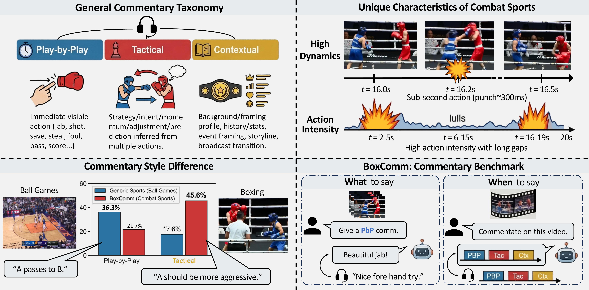

# BoxComm

[Project Page](https://gouba2333.github.io/BoxComm) | [Paper](http://arxiv.org/abs/2604.04419)



BoxComm is a boxing commentary benchmark and code release for category-aware commentary generation and narration-rhythm evaluation. This repository contains the data preparation, ASR post-processing, Qwen3-VL fine-tuning, inference, and evaluation scripts used in our pipeline.

The paper is:

> Kaiwen Wang, Kaili Zheng, Rongrong Deng, Yiming Shi, Chenyi Guo, Ji Wu.  
> **BoxComm: Benchmarking Category-Aware Commentary Generation and Narration Rhythm in Boxing**.  
> arXiv:2604.04419, 2026.

## Repository Layout

```text
.
├── asr/
│   ├── asr_whisperx.py
│   └── process_commentary_final.py
├── data/
│   ├── train/
│   │   ├── videos/
│   │   ├── events/
│   │   └── asr/
│   └── eval/
│       ├── videos/
│       ├── events/
│       └── asr/
├── notebooks/
│   └── visualize_sample_478.ipynb
├── scripts/
│   ├── prep_qwen3vl_sft_data.py
│   ├── train_qwen3vl.py
│   ├── infer_qwen3vl.py
│   ├── eval_metrics.py
│   └── eval_streaming_cls_metrics.py
├── static/
└── requirements.txt
```

`data/<split>/events/` should store one directory per match, and each match directory should contain both the skeleton `.pkl` file and `video_event_inference_3.json`.

## Environment Setup

We use a single Python environment for ASR, data preparation, Qwen3-VL training/inference, and evaluation.

```bash
conda create -n boxcomm python=3.10 -y
conda activate boxcomm
pip install -r requirements.txt
```

For scripts that use an OpenAI-compatible API, set:

```bash
export OPENAI_API_KEY=YOUR_KEY
# optional: only needed if you use a custom compatible endpoint
export OPENAI_BASE_URL=http://YOUR_SERVER/v1
```

If you want to run WhisperX diarization, also set:

```bash
export HF_TOKEN=YOUR_HUGGINGFACE_TOKEN
```

## Data Layout

After downloading the released data, place files as follows:

```text
data/
├── train/
│   ├── videos/     # training videos with id < 478
│   ├── events/     # per-video event folders, each containing .pkl + video_event_inference_3.json
│   └── asr/        # processed ASR json files, e.g. 1.json, 2.json, ...
└── eval/
    ├── videos/     # evaluation videos with id >= 478
    ├── events/
    └── asr/
```

The split convention used in this release is:

- `train`: video id `< 478`
- `eval`: video id `>= 478`

See [data/README.md](data/README.md) for a compact summary.

## ASR Pipeline

Step 1: run WhisperX on the raw match videos.

```bash
python asr/asr_whisperx.py
```

Step 2: run the final commentary post-processing pipeline to perform sentence split, boxing-term correction, timing refinement, and 3-way commentary classification.

```bash
python asr/process_commentary_final.py \
  --input_dir data/eval/asr_raw \
  --output_dir data/eval/asr
```

The final ASR JSON files consumed by the rest of the pipeline should contain `classified_segments`.

## Visualizing the Released Data

Open [notebooks/visualize_sample_478.ipynb](notebooks/visualize_sample_478.ipynb). The notebook shows how to:

- load video `id=478`
- decode frame `200`
- load the event-side skeleton `.pkl`
- overlay skeleton points on the frame
- inspect the first 10 commentary sentences
- inspect the first 10 detected events

## Preparing Qwen3-VL SFT Data

Prepare the training split:

```bash
python scripts/prep_qwen3vl_sft_data.py \
  --train \
  --video_dir data/train/videos \
  --json_dir data/train/asr \
  --event_dir data/train/events \
  --output_jsonl data/train/qwen3vl_sft_train.jsonl
```

Prepare the evaluation split:

```bash
python scripts/prep_qwen3vl_sft_data.py \
  --eval \
  --video_dir data/eval/videos \
  --json_dir data/eval/asr \
  --event_dir data/eval/events \
  --output_jsonl data/eval/qwen3vl_sft_eval.jsonl
```

`prep_qwen3vl_sft_data.py` packages:

- the current video clip midpoint
- the target commentary text
- the commentary class label
- previous commentary history
- previous detected punch events

## Fine-Tuning Qwen3-VL

```bash
python scripts/train_qwen3vl.py \
  --model_path /path/to/Qwen3-VL-8B-Instruct \
  --train_jsonl data/train/qwen3vl_sft_train.jsonl \
  --output_dir outputs/qwen3vl_lora_boxcomm \
  --with_class \
  --num_prev_events 16 \
  --bf16
```

This script performs LoRA SFT for category-conditioned commentary generation.

## Qwen3-VL Inference

Run category-conditioned inference on the evaluation split:

```bash
python scripts/infer_qwen3vl.py \
  --model_path /path/to/Qwen3-VL-8B-Instruct \
  --lora_path outputs/qwen3vl_lora_boxcomm \
  --input_jsonl data/eval/qwen3vl_sft_eval.jsonl \
  --output_jsonl outputs/qwen3vl_eval_predictions.jsonl \
  --with_class \
  --num_prev_events 16
```

For continuous streaming inference, please refer to the official [streaming-vlm](https://github.com/mit-han-lab/streaming-vlm) project and adapt its prediction outputs to the evaluation format below.

## Evaluation

### 1. Category-Conditioned Generation

Evaluate segment-level generated commentary against the prepared eval JSONL:

```bash
python scripts/eval_metrics.py \
  --gt_file data/eval/qwen3vl_sft_eval.jsonl \
  --pred_files outputs/qwen3vl_eval_predictions.jsonl \
  --output_json outputs/qwen3vl_eval_metrics.json
```

This script reports:

- BERTScore F1
- GPT-based semantic consistency
- per-class breakdown for class 1 / 2 / 3

### 2. Commentary Rhythm / Distribution Evaluation

For continuous commentary outputs, prepare one JSON line per video in the following format:

```json
{"video_id": 478, "responses": [{"start_time": 0.0, "end_time": 1.0, "response": "..."}, ...]}
```

Then run:

```bash
python scripts/eval_streaming_cls_metrics.py \
  --pred_jsonl outputs/streaming_predictions.jsonl \
  --asr_dir data/eval/asr \
  --output_json outputs/streaming_eval_metrics.json
```

This script reports:

- sentence-level 3-class temporal IoU
- minute-level KL divergence between predicted and ground-truth class distributions

## Notes

- The scripts in this release read API credentials from environment variables only. No keys are hard-coded.
- The event extraction JSON and skeleton PKL are expected to stay together under the same per-video event folder.
- The current release keeps only `infer_qwen3vl.py` for Qwen3-VL inference. Other model baselines used in internal experiments are not included here.
